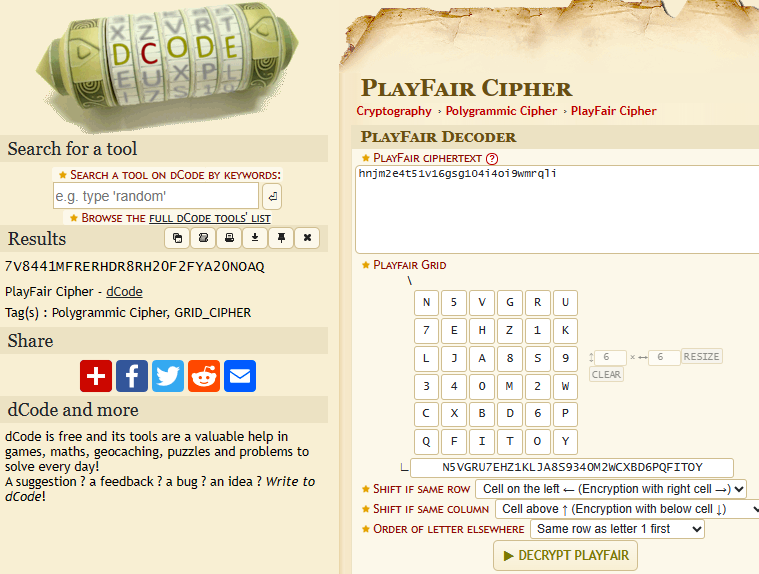

# Play Nice

Platform: PicoCTF 2021

## Description

> Not all ancient ciphers were so bad... The flag is not in standard format.
>*(Author: MADSTACKS)*

```bash
nc mercury.picoctf.net 19354
```

`playfair.py`:

```python
#!/usr/bin/python3 -u
import signal

SQUARE_SIZE = 6


def generate_square(alphabet):
    assert len(alphabet) == pow(SQUARE_SIZE, 2)
    matrix = []
    for i, letter in enumerate(alphabet):
        if i % SQUARE_SIZE == 0:
            row = []
        row.append(letter)
        if i % SQUARE_SIZE == (SQUARE_SIZE - 1):
            matrix.append(row)
    return matrix

def get_index(letter, matrix):
    for row in range(SQUARE_SIZE):
        for col in range(SQUARE_SIZE):
            if matrix[row][col] == letter:
                return (row, col)
    print("letter not found in matrix.")
    exit()

def encrypt_pair(pair, matrix):
    p1 = get_index(pair[0], matrix)
    p2 = get_index(pair[1], matrix)

    if p1[0] == p2[0]:
        return matrix[p1[0]][(p1[1] + 1)  % SQUARE_SIZE] + matrix[p2[0]][(p2[1] + 1)  % SQUARE_SIZE]
    elif p1[1] == p2[1]:
        return matrix[(p1[0] + 1)  % SQUARE_SIZE][p1[1]] + matrix[(p2[0] + 1)  % SQUARE_SIZE][p2[1]]
    else:
        return matrix[p1[0]][p2[1]] + matrix[p2[0]][p1[1]]

def encrypt_string(s, matrix):
    result = ""
    if len(s) % 2 == 0:
        plain = s
    else:
        plain = s + "n5vgru7ehz1klja8s9340m2wcxbd6pqfitoy"[0]
    for i in range(0, len(plain), 2):
        result += encrypt_pair(plain[i:i + 2], matrix)
    return result

alphabet = open("key").read().rstrip()
m = generate_square(alphabet)
msg = open("msg").read().rstrip()
enc_msg = encrypt_string(msg, m)
print("Here is the alphabet: {}\nHere is the encrypted message: {}".format(alphabet, enc_msg))
signal.alarm(18)
resp = input("What is the plaintext message? ").rstrip()
if resp and resp == msg:
    print("Congratulations! Here's the flag: {}".format(open("flag").read()))

# https://en.wikipedia.org/wiki/Playfair_cipher
```

## Solution

The provided program implements the Playfair cipher, which is a classical substitution cipher that operates on pairs of letters in a matrix. At the bottom of program we also see the hint provided about Playfair cipher.
When we connect to the service, we got the following:

```bash
meldstorm-picoctf@webshell:~$ nc mercury.picoctf.net 19354
Here is the alphabet: n5vgru7ehz1klja8s9340m2wcxbd6pqfitoy
Here is the encrypted message: hnjm2e4t51v16gsg104i4oi9wmrqli
What is the plaintext message? 
```

We can easily get the plaintext with [dcode](https://www.dcode.fr/playfair-cipher). The grid used is 6x6 because the given alphabet has 36 characters.

Convert uppercase characters to lowercase first and pass it to the service get the flag.

```bash
┌──(meld㉿meld)-[~]
└─$ echo "WD9BUKBSPDTJ7SKD3KL8D6OA3F03G0" | tr '[:upper:]' '[:lower:]'
wd9bukbspdtj7skd3kl8d6oa3f03g0
```

**flag:** `dbc8bf9bae7152d35d3c200c46a0fa30`
